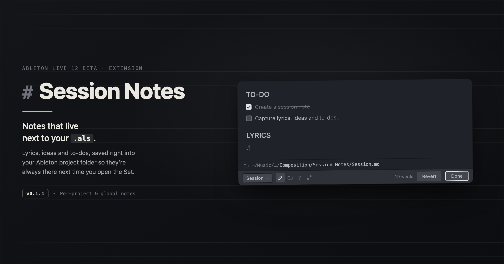

# Session Notes

<picture>
  <source media="(prefers-color-scheme: dark)" srcset="assets/session-notes-cover.png">
  <source media="(prefers-color-scheme: light)" srcset="assets/session-notes-cover-light.png">
  
</picture>

A minimal Markdown notepad for **Ableton Live 12**, built on the [Live Extensions SDK](https://ableton.com). Jot lyrics, ideas, and to-dos without leaving Live — with clean, native-feeling typography and a render-by-default Markdown view.

> Requires Ableton Live 12 with the Extensions feature (SDK `1.0.0-beta.0`).

## Features

- **Markdown, rendered by default.** Write in Markdown; a single tap or `⌘E` toggles between **View** and **Edit**. Headings, bullet/numbered lists, bold/italic, blockquotes, links, and clickable GFM task lists (`- [ ]` / `- [x]`).
- **Two kinds of notes:**
  - **Per-project notes** — saved into a `Session Notes/` folder inside the current Ableton project, so they **travel with the Set** when you move, share, or back it up. Keep as many as you like per project.
  - **Global notes** — notes that live with the extension, for anything not tied to a specific Set.
- **Manage notes in place.** Create, rename, and delete notes from the dropdown; copy a note's path or reveal it in your file browser; switch between a compact and default pad size.
- **Save-As aware.** Start jotting in an unsaved Set, then save it — the pad offers to carry those notes into the new project folder.
- **Autosave on close.** Close the pad (**Done**, `⌘S`, or `Esc`) and it saves; **Revert** discards edits made since you opened it.
- **Remembers your place.** Reopens whatever note you had open last.
- **Show file location** and a built-in **Markdown cheatsheet** (the `?` button).

## Install

1. Download the latest `Session-Notes-<version>.ablx` from the [Releases](../../releases) page.
2. In Live: **Settings → Extensions**, then drag the `.ablx` file onto the page.
3. Right-click a track, clip slot, or scene → **Session Notes → Open…**

## Usage notes

- Open it from the right-click menu on an **audio/MIDI track, clip slot, or scene**. (The SDK has no global menu, so it attaches to the objects you can reach almost anywhere.)
- **Per-project detection** works even for MIDI-only Sets: if there's no audio to trace, the extension briefly imports a tiny silent probe to learn where the project folder is, then removes it.
- An **unsaved** Set has no project folder yet, so notes live in Ableton's temporary folder until you save. Save the Set (and reopen it once) and your notes attach to the project; a hint reminds you until then.

## Develop

```bash
npm install
npm start        # build + run in Live's Extension Host (Developer Mode must be ON)
npm run build    # dev bundle
npm run package  # production bundle → Session-Notes-<version>.ablx
```

Node ≥ 22.11 is required (the SDK's minimum). Source lives in `src/extension.ts` (host logic) and `src/interface.html` (the webview UI).

## License

MIT © Bengisu ([@somaluden](https://github.com/somaluden))
