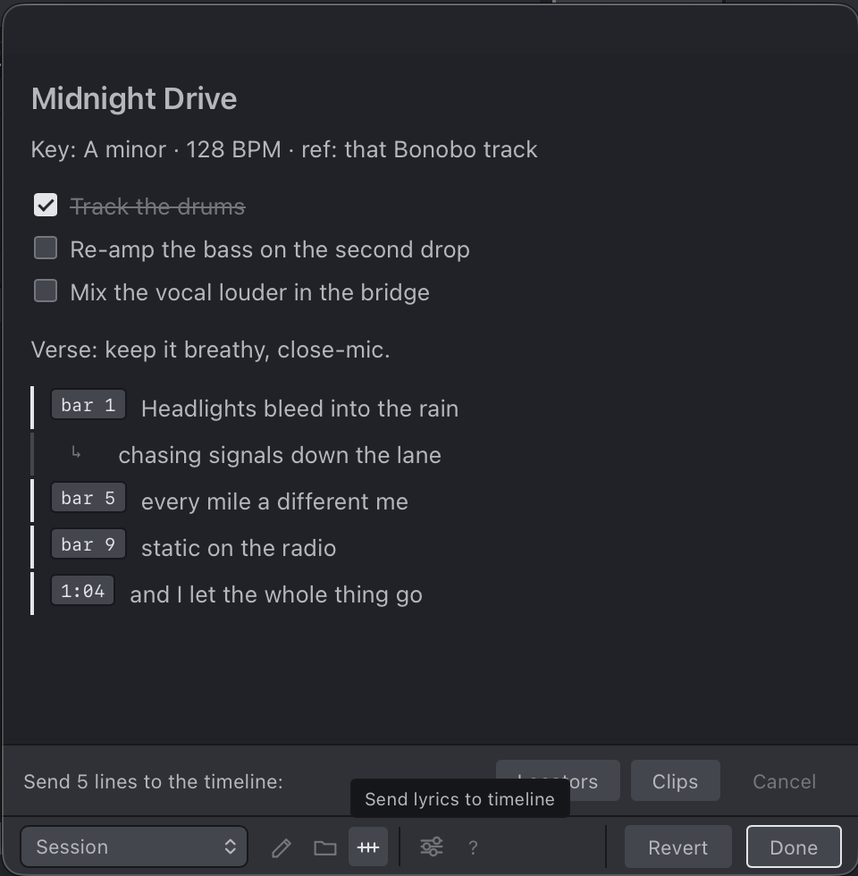
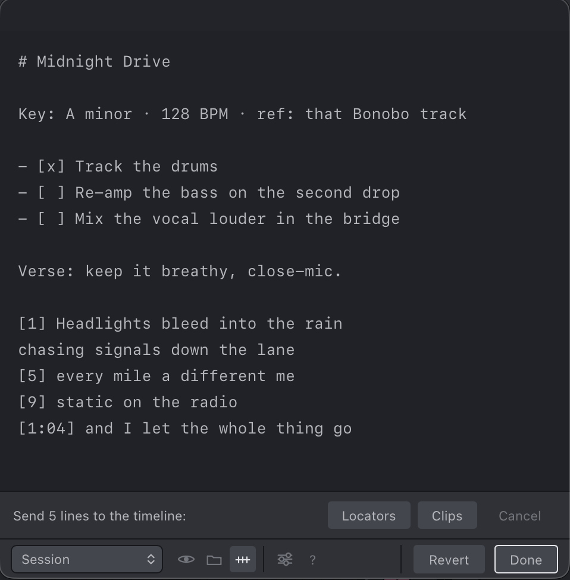
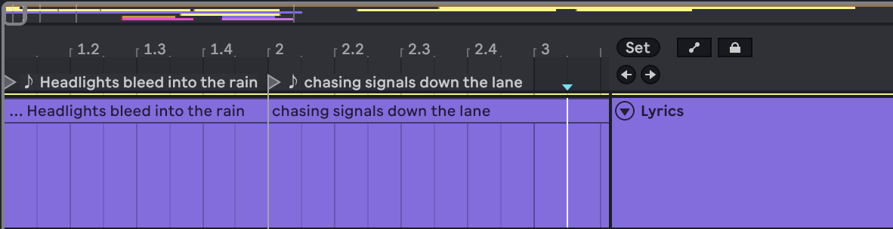
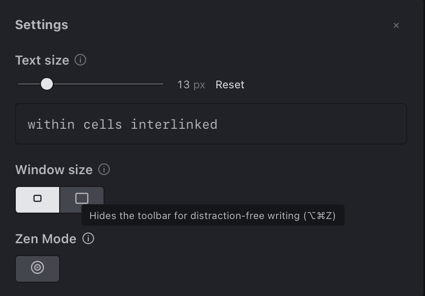
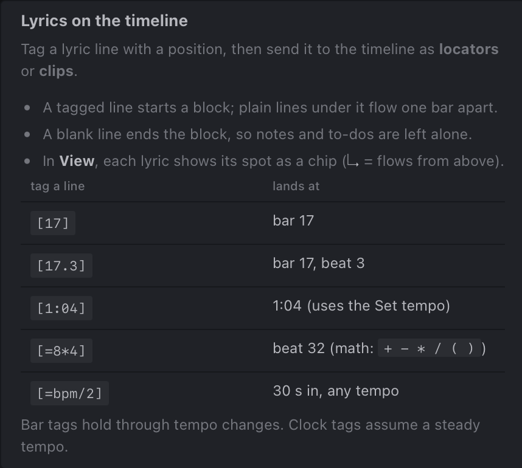

# Session Notes

<picture>
  <source media="(prefers-color-scheme: dark)" srcset="assets/session-notes-cover.png">
  <source media="(prefers-color-scheme: light)" srcset="assets/session-notes-cover-light.png">
  
</picture>

A minimal Markdown notepad for **Ableton Live 12**, built on the [Live Extensions SDK](https://ableton.com). Jot lyrics, ideas, and to-dos without leaving Live, with clean, native-feeling typography and a render-by-default Markdown view. Tag a lyric line with a bar or timecode and drop it straight onto the arrangement.

> Requires Ableton Live 12 with the Extensions feature (SDK `1.0.0-beta.0`).

## Features

- **Markdown, rendered by default.** Write in Markdown; a single tap or `⌘E` toggles between **View** and **Edit**. Headings, bullet/numbered lists, bold/italic, blockquotes, links, and clickable GFM task lists (`- [ ]` / `- [x]`).
- **Lyrics on the timeline.** Tag a lyric line with its position, then send the block to the arrangement as **locators** or **clips**. Positions can be a bar (`[17]`), a bar and beat (`[17.3]`), a timecode (`[1:04]`), or a bit of math (`[=8*4]`). Untagged lines under a tag flow one bar apart, and a blank line ends the block so your prose and to-dos are left alone.
- **Two kinds of notes:**
  - **Per-project notes** are saved into a `Session Notes/` folder inside the current Ableton project, so they **travel with the Set** when you move, share, or back it up. Keep as many as you like per project.
  - **Global notes** live with the extension, for anything not tied to a specific Set.
- **Manage notes in place.** Create, rename, and delete notes from the dropdown; copy a note's path or reveal it in your file browser.
- **Settings panel.** Tune the note text size, pick a compact or default window, and flip on **Zen Mode** for distraction-free writing.
- **Save-As aware.** Start jotting in an unsaved Set, then save it: the pad offers to carry those notes into the new project folder.
- **Autosave on close.** Close the pad (**Done**, `⌘S`, or `Esc`) and it saves; **Revert** discards edits made since you opened it.
- **Remembers your place.** Reopens whatever note you had open last.
- **Show file location** and a built-in **Markdown & lyric-timing help** (the `?` button).

## See it in action

Write in Markdown, hit **View** to render it, then tag any lyric line with its position and send the block to the arrangement:

| In the note (View) | Ready to send |
| :---: | :---: |
|  |  |

They land on the timeline as named **locators** (on the ruler) and **clips** (on a dedicated Lyrics track), lined up to the bars and timecodes you tagged:



Settings and the built-in help are a button away:

| Settings | Markdown & lyric-timing help |
| :---: | :---: |
|  |  |

Try it yourself: paste this into a note, switch to **View**, then press the timeline button.

```markdown
# Midnight Drive

Key: A minor · 128 BPM · ref: that Bonobo track

- [x] Track the drums
- [ ] Re-amp the bass on the second drop
- [ ] Mix the vocal louder in the bridge

Verse: keep it breathy, close-mic.

[1] Headlights bleed into the rain
chasing signals down the lane
[5] every mile a different me
[9] static on the radio
[1:04] and I let the whole thing go
```

The `#` heading, the prose line, and the to-dos are ignored by the timeline; only the tagged block is sent. The untagged `chasing signals down the lane` flows one bar after `[1]`.

## Install

1. Download the latest `Session-Notes-<version>.ablx` from the [Releases](../../releases) page.
2. In Live: **Settings → Extensions**, then drag the `.ablx` file onto the page.
3. Right-click a track, clip slot, or scene → **Extensions → Session Notes: Open…**

## Usage notes

- Open it from the right-click menu on an **audio/MIDI track, clip slot, or scene**. (The SDK has no global menu, so it attaches to the objects you can reach almost anywhere.)
- **Per-project detection** works even for MIDI-only Sets: if there's no audio to trace, the extension briefly imports a tiny silent probe to learn where the project folder is, then removes it.
- An **unsaved** Set has no project folder yet, so notes live in Ableton's temporary folder until you save. Save the Set (and reopen it once) and your notes attach to the project; a hint reminds you until then.

## Develop

```bash
npm install
npm start        # build + run in Live's Extension Host (Developer Mode must be ON)
npm run build    # dev bundle
npm run package  # production bundle → Session-Notes-<version>.ablx
```

Node ≥ 22.11 is required (the SDK's minimum). Source lives in `src/extension.ts` (host logic) and `src/interface.html` (the webview UI).

## License

MIT © Bengisu ([@bengybade](https://github.com/bengybade))
